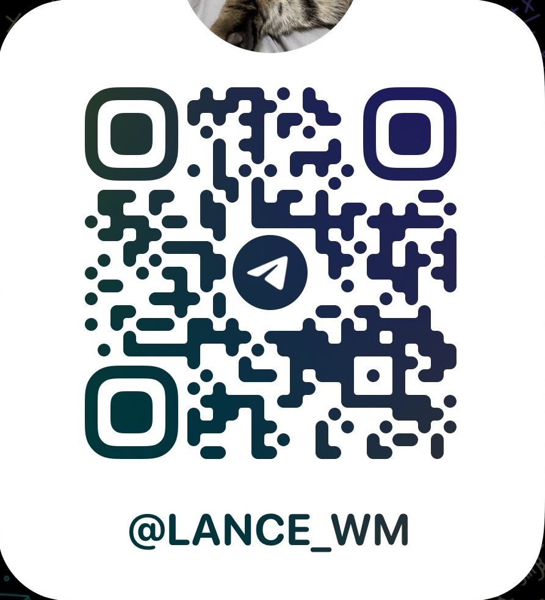

# 連絡我們

!!! example "連絡方式"

    

    -   :simple-telegram:{ .lg .middle } __Telegram__

        ---
        

        { width="150"}
        

    -   :material-instagram:{ .lg .middle } __IG__

        ---
        

        { width="150"}
        

    -   :fontawesome-brands-line:{ .lg .middle } __Line__

        ---
        

        { width="150"}
        

    -   :material-gmail:{ .lg .middle } __E-MAIL__ 

        ---
        

        { width="200"}
        

        

    

## 請留下您的建議

<embed src="https://docs.google.com/forms/u/0/d/e/1FAIpQLSetHaNi_OwvEYTW7jt5YewS7su4IQcqy_WjYJxfvnO2iQcgcA/formResponse" width="600" height="900"/>
