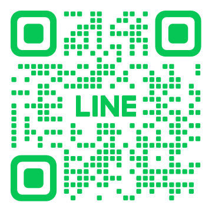

# 連絡或合作提案

!!! example "連絡方式"

    

    -   :simple-telegram:{ .lg .middle } __Telegram__

        ---
        

        { width="150"}
        

    -   :fontawesome-brands-line:{ .lg .middle } __Line__

        ---
        

        { width="150"}
        

    -   :material-gmail:{ .lg .middle } __E-MAIL__ 

        ---
        

        { width="150"}
        

        

    

