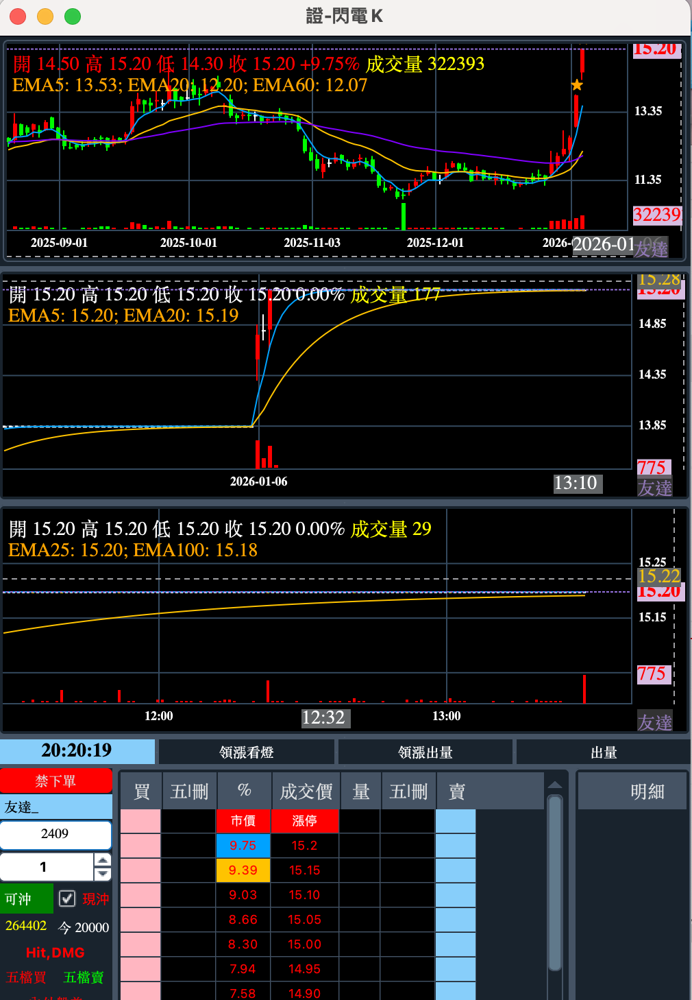

# EyeTrading 特色

## 閃電下單+多週期K線

!!! example "閃電K線"

    1. 一鍵置中: 右鍵點擊可以快速將五檔價格拉回中間位置.
    2. 多時間週期K線: 直接將個股的1分K、5分K、日K 整合在閃電下電介面上，並能即時更新.
    3. 閃電下單整合均線: 閃電下單欄位整合1分K的均線位置，同時也提示日K均線價.
    4. 當日預估量: 計算個股當日預估量及昨日成交量.

    

## K線圖整合閃電下單

!!! example "K線圖整合閃電下單"

    <iframe width="560" height="315" src="https://www.youtube.com/embed/0T25R1PQb5g?si=7uEwrVbjSOqa5EXP" title="YouTube video player" frameborder="0" allow="accelerometer; autoplay; clipboard-write; encrypted-media; gyroscope; picture-in-picture; web-share" referrerpolicy="strict-origin-when-cross-origin" allowfullscreen></iframe>

    一分K、閃電下單、簡易成交明細資料串API即時行情。

## Candlestick chart

!!! example "K線圖"

    <iframe width="560" height="315" src="https://www.youtube.com/embed/jNrxLbbnkHE?si=Cedm5UKyEHRxYDpc" title="YouTube video player" frameborder="0" allow="accelerometer; autoplay; clipboard-write; encrypted-media; gyroscope; picture-in-picture; web-share" referrerpolicy="strict-origin-when-cross-origin" allowfullscreen></iframe>

    日K、五分K、一分K 串API即時行情。

## 盤中選股

!!! example "盤中選股功能"

    <iframe width="560" height="315" src="https://www.youtube.com/embed/DsrV-12hjKU?si=_SF0mCHjKmHKUqgA" title="YouTube video player" frameborder="0" allow="accelerometer; autoplay; clipboard-write; encrypted-media; gyroscope; picture-in-picture; web-share" allowfullscreen></iframe>

    根據前一交易日的個股中，設定當日相關絛件設定，於盤中即時更新選股狀態，然後將選出之個股列出，其中排序方式可根據成交量、漲跌以及獨家開發的K量排序，{==K量排序可快速找出當下成交量放大的個股==}。

