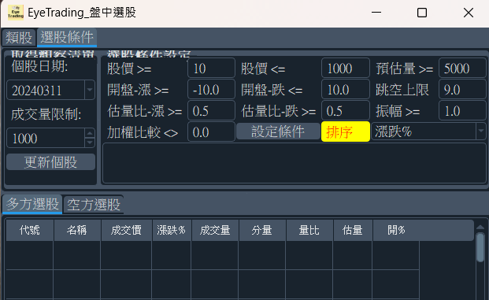
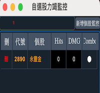
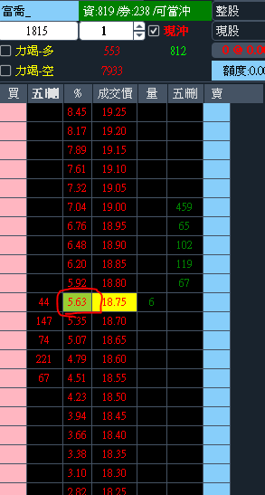
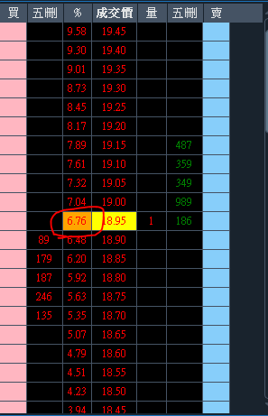

# EyeTrading 特色

## 盤中選股

!!! example "盤中選股功能"

    { width="500"}

    根據前一交易日的個股中，設定當日相關絛件設定，於盤中即時更新選股狀態，然後將選出之個股列出，其中排序方式可根據成交量、漲跌以及獨家開發的K量排序，{==K量排序可快速找出當下成交量放大的個股==}。

## 買賣力竭

!!! example "買賣力竭"

    { width="300" align=left}

    1. 自選個股: 可自行增加或減少欲監控的個股。
    2. Hit: 連續攻擊.
    3. DMG: 總傷害量.
    4. Combo: 綜合 Hit and DMG的燈號.

## 閃電下電機器人

!!! example "閃電下電機器人"

    1. 報價欄位可調: 報價欄寬度可自行調整，視窗大小也可縮放，不佔用畫面太多空間。
    2. 力道指標: 內建力道指標提供參考(指標僅提供參考並非投資建議，並不保證獲利且可能有虧損，投資相關決策需自負盈虧)

        - 當買方力道加強時會在 % 欄位顯示 橘色；反向來說，當指標消失時即代表買方力竭。
        - 當賣方力道加強時會在 % 欄位顯示 綠色；反向來說，當指標消失時即代表賣方力竭。

    3. {-- 自動下單: 根據力道指標訊號進行自動下單(訊號並不保證獲利，自動下單功能需自負盈虧)--}
        - {--勾選 力竭-多: 則指標賣方訊號出現時進入監控狀態，訊號消失時即自動下買單.--}
        - {--勾選 力竭-空: 則指標買方訊號出現時進入監控狀態，訊號消失時即自動下賣單.--}
    
    4. 買賣盤差: 直接顯示當日買賣盤差數據.

    { width="300" align=left}

    { width="300" align=right}

