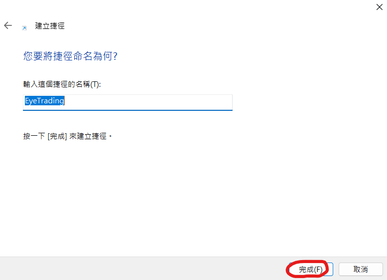

# 安裝與設定 EyeTrading

## 下載免安裝版

!!! warning "請確定您有 永豐金證券 的帳戶並且有申請 Shioaji API 的使用權限。"

!!! warning "測試版限制"

    - 使用期限:  2024/03/31
    - 下單數量:  1 張
    - 下單視窗:  1 個

!!! info "Windows版"

    [EyeTrading 免安裝版 V0.3](../assets/EyeTrading.7z)

## 設定

!!! note "設定檔路徑"

    請至解壓縮後的資料夾(通常為 X:\EyeTrading\ )內尋找 config.json，然後打開這個檔案，這是Shioaji api所需要的相關設定.

{ align=left }

!!! success ""

    * shioaji_key_name: 輸入設定的key name.(可填可不填)
    * shioaji_key_expire_date: key的過期時間，小於30天時會提醒.(格式: yyyy-mm-dd)
    * shioaji_api_key: 輸入api_key.
    * shioaji_screate_key: 輸入screate_key.
    * ca_path: 輸入憑證的路徑.
    * ca_pid: 輸入個人的ID.
    * ca_passwd: 輸入憑證的密碼.

    
## 建立桌面捷徑

!!! example "建立捷徑"

    1. 在桌面空白處按滑鼠右鍵後選擇 新增 -> 捷徑
    2. 出現設定的畫面中選擇 瀏覽
    3. 瀏覽至資料夾 EyeTrading 內，選擇 EyeTrading.exe
    4. 回至建立捷徑畫面後，確認輸入項的位置的檔案是 EyeTrading.exe 後按下一步.
    5. 按完成，即可在桌面看到 EyeTrading.exe 的圖示.

    (可參考下方圖片資訊)

{ width="300"}

{ width="450"}

{ width="450"}

{ width="450"}

{ width="450"}

{ width="450"}

## 執行

!!! note "請先執行校時程式"

    目前已設定完成，要執行程式之前，請先下載並執行 <a href="https://www.stdtime.gov.tw/chinese/details/details.htm" target="_blank">網路校時軟體</a> 以避免登入時發生 Timeout Error，然後點擊剛剛建立的 Eyetrading 桌面捷徑.

    { width="200"}