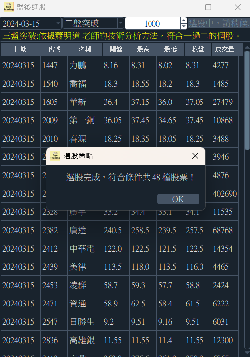
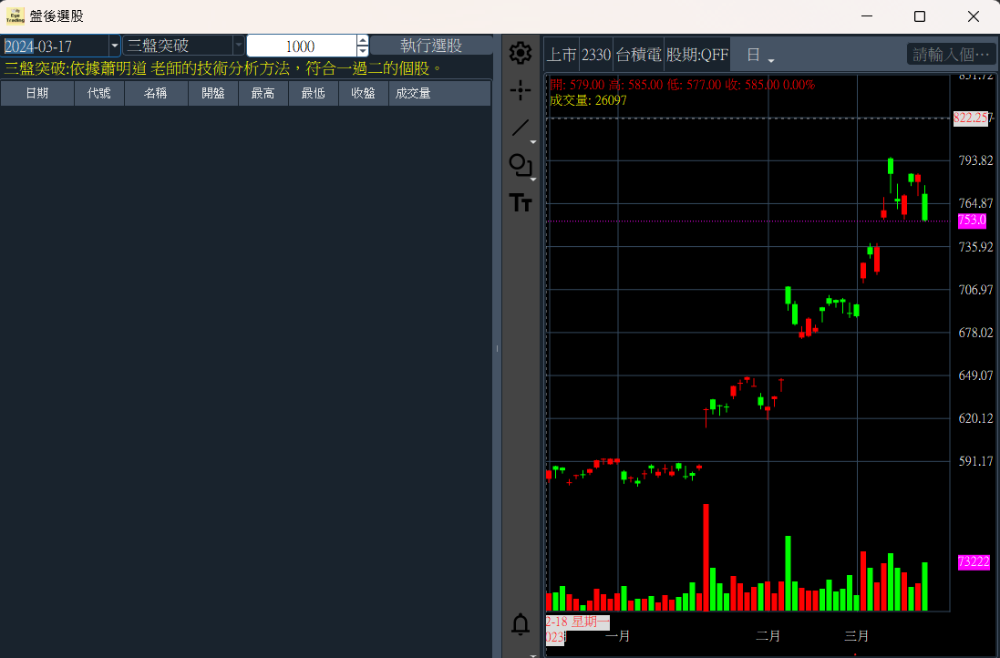

# EyeTrading 功能說明

!!! warning

    盤後選股中的K線圖為開發中，功能尚未完備並有些許Bugs.

## 盤後選股(Dev)

!!! info "盤後選股"

    

    此功能為開發階段，畫面說如下：

    - 日期: 盤後可選擇當日
    - 策略: 目前只設計 三盤突破
    - 1000: 成交量限定需大於此值，可調高.
    - 執行選股: 設定完上述條件之後，點選此會開始進行選股，符合條件的個股會條列在下方的欄位內。

    欄位畫面:

    - 日期: 此為取得個股的最新一筆的資料.
    - 代號與名稱: 點選此欄位後，K線圖會更新為此個股的 日 線圖

    K線圖(Dev):(目前只有Mac版有 Chart)

    - 設定: 可以設定 均線.

    

