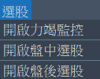

# EyeTrading 功能說明

## 主畫面

!!! success ""

    {width="450"}

    * 選單:系統、下單、{~~監控訊號~> 選股~~}。
    * 目前時間
    * 取消所有委託單
    * 系統記錄
    * 個股訊號記錄表
    * 委託單記錄表
    

## 系統選單

!!! success ""

    { width="250"}

    * 登入Shioaji Api: 登入Shioaji API並且 active 憑證功能。({==已登入時停用，防誤點選。==})
    * 登出Shioaji Api: 登出Shioaji API，登出前會取消所有未成交之委託單。({==登出後開啟登入選單==})
    * 登入Shioaji Api-模擬: 登入Shioaji API (Simulation mode = True)，無啟用憑證。({==已登入時停用，防誤點選。==})
    * {++設定Shioaji API++}: 設定 Shioaji api 登入所需要的資料。
    * 查看Shioaji API 用量: 查詢目前API 的連線數及資料使用量。
    * 離開: 離開程式。

## 下單選單

!!! success ""

    { width="250"}

    * 開啟閃電機器人: 開啟閃電機器人下單畫面。
    * 取消所有委託: 取消所有未成交之委托單。
    * 更新部位: 更新成交部位資訊。

## 選股選單

!!! success ""

    { width="250"}

    * {--儲存監控訊號: 將個股訊號記錄表匯出至csv檔。--}
    * {++開啟力竭監控: 開啟自選個股力竭監控視窗。++}
    * {++開啟盤中選股: 開啟盤中選股功能視窗。++}
    * {~~啟動/停止盤中選股: 啟動/停止 盤中選股功能。~> 啟動功能移至選股視窗~~}
    * {++開啟盤後選股: 開啟盤後選股功能視窗。++}

## 委託單記錄表:取消委託單

!!! success ""

    

    * 狀態: 當委託狀態為 委託成功 時，點選委託成功可以取消這筆委託單。

