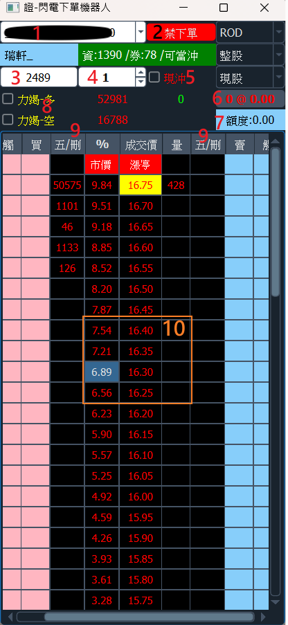
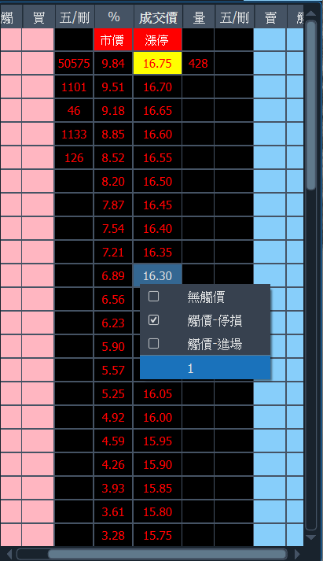

# EyeTrading 功能說明

## 閃電下單

!!! info
    目前下單功能只支援個股。

!!! warning "零股"
     報價目前以整股為主，非零股報價，僅供參考

!!! success "閃電下單畫面"

    { width="250"}

    1. 帳號資訊: 登入後由Shioaji api回傳資料.
    2. 禁止下單: 防止貓咪誤擊滑鼠，啟用時無法下單，下單時會提醒解除功能後才可下單.
    3. 個股代碼: 輸入個股代碼.
    4. 下單數量: 設定下單量.
    5. 現股當沖: 勾選後設為現股當沖，現先賣需勾選.
    6. 部位與均價: 目前個股的部位與均價，點選可更新.
    7. 額度: 今日交易量，只計算買入，現先賣未列入計算.
    8. 機器人: 勾選後，根據內建指標，當賣方力道變弱時自動下買單；當買方力道減少時自動下賣單(當價格離漲停價不遠則不會下賣單).
    9. 五/刪: 取消單邊的所有買(賣)委託單.
    10. 價格置中/右鍵選單: 滑鼠左鍵點選 %、成交價、量 任一位置，五檔成交顯示至畫面中間；右鍵則顯額外功能.
    11. 單擊下單: 點擊即下單，不需點擊兩下.
    12. 觸、買(賣)、五/刪: 觸:設觸價單、買(賣):送出委託單、五/刪:取消此欄位的觸價或買(賣)委託單.

## 右鍵快捷選單

!!! success "閃電下單右鍵選單"

    { width="250" }

    * 無觸價: 勾選後，取消觸價功能.
    * 觸價-停損: 勾選後，觸價價格為範圍避免穿價(目前設定10檔價位).
    * 觸價-進場: 勾選後，成交價等於觸價觸格時送出委託單.
    * 1: 下單量快速設定。
