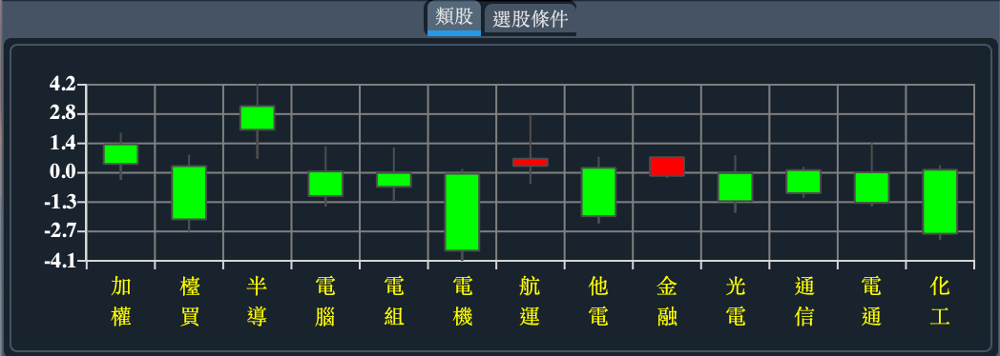
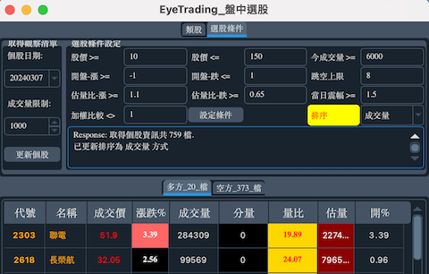
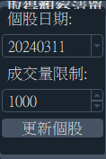
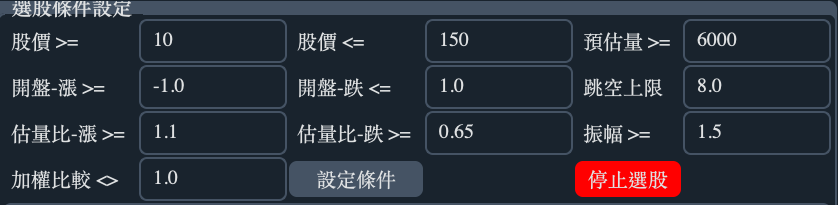
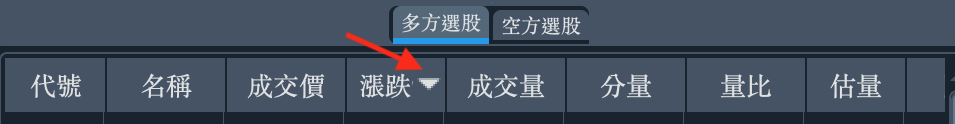
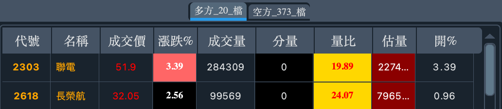

# EyeTrading 功能說明

!!! warning

    類股及選股功能會耗用 Shioaji api 流量，使用量則依據個股數量而定。請參考 <a href="https://sinotrade.github.io/zh_TW/tutor/limit/" target="_blank">Shioaji api 流量限制</a>.

## 類股漲跌

!!! info "類股"
    當日加權指數、櫃買指數以及成交金額排名前11名的類股 K線.

## 盤中即時選股

!!! info "Step 1:取得個股清單"

    { width="250"}

    * 個股日期: 請設定為 前一交易日  的日期。
    * 成交量限制(單位:張): 預設為 1000，表示前一交易日個股成交量 > 1000張的個股。(Minimun:800)
    * 更新個股: 點選之後會自動取得上述設定之個股清單，取得個股清單或異常會有相關訊息出現在選股條件設定的訊息欄位。(因網路關係會有短暫延遲)

    !!! warning "提醒"

        選股功能請務必設定先取得個股清單.

!!! info "Step 2:設定條件"

    { width="500"}

    - 股價>=: 成交價 高於此設定的個股.
    - 股價<=: 成交價 低於此設定的個股.
    - 今預估量>=: 預估成交量 高於此設定的個股.({==此為預估值，非實際成交量==})
    - 開盤-漲>=: 開盤漲幅 高於此設定的個股.
    - 開盤-跌>=: 開盤漲幅 低於此設定的個股.
    - 跳空上限>=: 開盤漲幅 高於或低於此設定的個股.({==跟漲跌相關==})
    - 估量比-漲>=: 估量比 高於此設定的個股.
    - 估量比-跌>=: 估量比 高於此設定的個股.
    - 當日振幅>=: 當日振幅 高於此設定的個股.
    - 加權比較>=: 當日漲跌幅 與加權漲跌幅差.

    設定完條件之後，點選  設定條件 後即可生效，下次會使用相同設定。 
     
    {~~排序方式為下拉式選單，直接選用即可，目前有三種排序~> 調整為點選欄位標題即切換排序~~}

    { width="400"}

        - 漲跌幅: 依漲跌幅大小排序
        - 成交量: 依成交量大小排序
        - {++分量++}: {==依K量大小排序==}
        - 成交價: 依成交價大小排序
        - 量比: 依量比大小排序
        - 估量: 依預估量比大小排序

!!! info "Step 3:啟動盤中選股"

    

    - 顯示為 停止選股: {==表示目前是停止狀態==}
    - 顯示為 選股中: {==表示目前是啟動選股狀態==}

    啟動後，於交易時間 09:00~13:30 將會依條件選出個股. 
    點選  停止選股/ 選股中可以隨時{==啟動/停止==}此功能.
     

!!! info "完成"

    下方選股頁面會顯示依據條件設定所選出的多方或空方個股清單以及數量.

    { width="500"}
