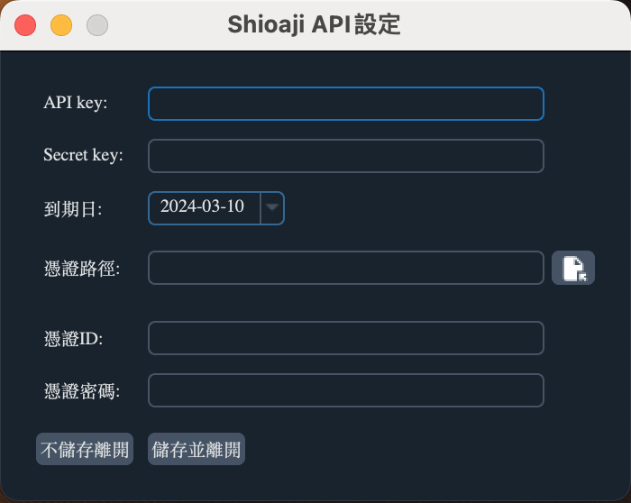

# EyeTrading 功能說明

## Shioaji API 設定

{ width="300" align=left }

!!! info "欄位說明"

    1. API Key: 請填入 Shioaji API Key.
    2. Secret key: 請填入 Shioaji Scret Key.
    3. 到期日: 此API Key 的到期日.
    4. 憑證路徑: 選擇憑證檔案後會代入檔案的路徑.
    5. 憑證ID: 憑證的ID.
    6. 憑證密碼: 憑證使用的密碼.
    7. 不儲存離開: 直接關閉視窗.
    8. 儲存並離開: 設定完成之後，下次就不用再設定相關資訊.
    

