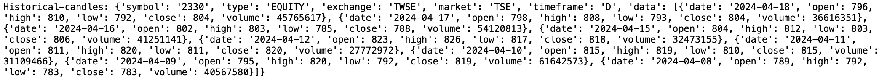
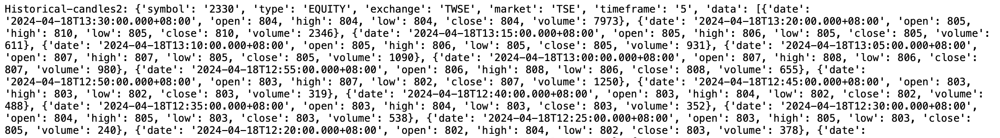
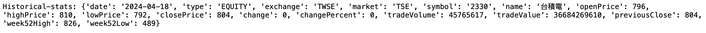

# 富邦Neo API 操作記錄--歷史行情


## 富邦Neo API

Neo API為富邦證券最近推出新的跨平台API，其提供三種程式語言:{==Python、Nodejs、C#==}，詳細的介紹可以參考<a href="https://www.fbs.com.tw/TradeAPI/" target="_blank">富邦網站</a>，這裡將記錄在操作api的相關過程。


## 富邦Neo API 歷史行情

!!! example "<a href="https://www.fbs.com.tw/TradeAPI/docs/market-data/http-api/snapshot/quotes" target="_blank">Snapshot</a>"

    ```
    # 首先需登入 API
    from fubon_neo.sdk import FubonSDK
    
    sdk = FubonSDK()
    res = sdk.login("{==登入ID==}", "{==登入密碼==}",  "{==憑證路徑==}",  "{==憑證密碼==}")
    
    # 登入成功後，取得 account資料。
    if res.is_success:
        account = res.data

    ===============
    # 歷史行情 初始設定

    sdk.init_realtime()     # 建立行情連線
    rest_stock = sdk.marketdata.rest_client.stock          {==# 這個會一直用到==}
    
    ```

## Candles

!!! example "歷史股價"

    - symbol: 代號
    - from: 2024-04-01
    - to: 2024-04-18
    - timeframe: 1, 5, 10, 15, 30, 60 ,D, W, M
    - fields: open, high, low, close, volume, turnover, change

    ```
    {++# Candles++}
    {==# 記得要加 ** 否則會 error:Historical.candles() takes 1 positional argument but 2 were given ==}
    res = rest_stock.historical.candles({==**==}{'symbol': '2330', 'from': '2024-04-06', 'to': '2024-04-18'})
    print(res)

    Historical-candles: {'symbol': '2330', 'type': 'EQUITY', 'exchange': 'TWSE', 'market': 'TSE', 'timeframe': 'D', 'data': [{'date': '2024-04-18', 'open': 796, 'high': 810, 'low': 792, 'close': 804, 'volume': 45765617}, {'date': '2024-04-17', 'open': 798, 'high': 808, 'low': 793, 'close': 804, 'volume': 36616351}, {'date': '2024-04-16', 'open': 802, 'high': 803, 'low': 785, 'close': 788, 'volume': 54120813}, {'date': '2024-04-15', 'open': 804, 'high': 812, 'low': 803, 'close': 806, 'volume': 41251141}, {'date': '2024-04-12', 'open': 823, 'high': 826, 'low': 817, 'close': 818, 'volume': 32473155}, {'date': '2024-04-11', 'open': 811, 'high': 820, 'low': 811, 'close': 820, 'volume': 27772972}, {'date': '2024-04-10', 'open': 815, 'high': 819, 'low': 810, 'close': 815, 'volume': 31109466}, {'date': '2024-04-09', 'open': 795, 'high': 820, 'low': 792, 'close': 819, 'volume': 61642573}, {'date': '2024-04-08', 'open': 789, 'high': 792, 'low': 783, 'close': 783, 'volume': 40567580}]}
    
    ```
    
    

    ```
    {++# Candles++}
    {==# 記得要加 ** 否則會 error:Historical.candles() takes 1 positional argument but 2 were given ==}
    res = rest_stock.historical.candles({==**==}{'symbol': '2330', 'timeframe': 5})
    print(res)
    {==# 官網寫分K資料是 5日內，但我取 5分k是回傳一個月的資料 ==}
    Historical-candles2: {'symbol': '2330', 'type': 'EQUITY', 'exchange': 'TWSE', 'market': 'TSE', 'timeframe': '5', 'data': [{'date': '2024-04-18T13:30:00.000+08:00', 'open': 804, 'high': 804, 'low': 804, 'close': 804, 'volume': 7973}, {'date': '2024-04-18T13:20:00.000+08:00', 'open': 805, 'high': 810, 'low': 805, 'close': 810, 'volume': 2346}, {'date': '2024-04-18T13:15:00.000+08:00', 'open': 805, 'high': 806, 'low': 805, 'close': 805, 'volume': 611}, {'date': '2024-04-18T13:10:00.000+08:00', 'open': 805, 'high': 806, 'low': 805, 'close': 805, 'volume': 931}, {'date': '2024-04-18T13:05:00.000+08:00', 'open': 807, 'high': 807, 'low': 805, 'close': 805, 'volume': 1090}, {'date': '2024-04-18T13:00:00.000+08:00', 'open': 807, 'high': 808, 'low': 806, 'close': 807, 'volume': 980}, {'date': '2024-04-18T12:55:00.000+08:00', 'open': 806, 'high': 808, 'low': 806, 'close': 808, 'volume': 655}, {'date': '2024-04-18T12:50:00.000+08:00', 'open': 803, 'high': 807, 'low': 802, 'close': 807, 'volume': 1250}, {'date': '2024-04-18T12:45:00.000+08:00', 'open': 803, 'high': 803, 'low': 802, 'close': 803, 'volume': 319}, {'date': '2024-04-18T12:40:00.000+08:00', 'open': 803, 'high': 804, 'low': 802, 'close': 802, 'volume': 488}, {'date': '2024-04-18T12:35:00.000+08:00', 'open': 803, 'high': 804, 'low': 803, 'close': 803, 'volume': 352}, {'date': '2024-04-18T12:30:00.000+08:00', 'open': 804, 'high': 805, 'low': 803, 'close': 803, 'volume': 538}, {'date': '2024-04-18T12:25:00.000+08:00', 'open': 803, 'high': 805, 'low': 803, 'close': 805, 'volume': 240}, {'date': '2024-04-18T12:20:00.000+08:00', 'open': 802, 'high': 804, 'low': 802, 'close': 803, 'volume': 378}, {'date': '2024-04-18T12:15:00.000+08:00', 'open': 803, 'high': 804, 'low': 802, 'close': 802, 'volume': 265},...]}
    
    ```
    
    

## Historical Stats

!!! example "52週統計資料"

    - symbol

    ```
    {++# Stats++}
    res = rest_stock.historical.stats(symbol='2330')
    print(res)

    Historical-stats: {'date': '2024-04-18', 'type': 'EQUITY', 'exchange': 'TWSE', 'market': 'TSE', 'symbol': '2330', 'name': '台積電', 'openPrice': 796, 'highPrice': 810, 'lowPrice': 792, 'closePrice': 804, 'change': 0, 'changePercent': 0, 'tradeVolume': 45765617, 'tradeValue': 36684269610, 'previousClose': 804, 'week52High': 826, 'week52Low': 489}
    
    ```
    
    
