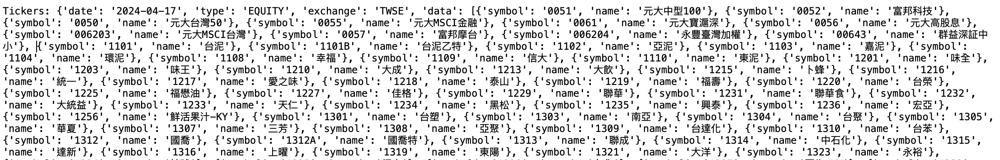
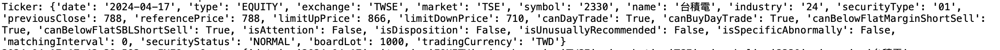
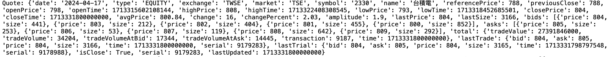
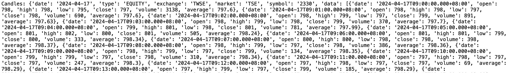
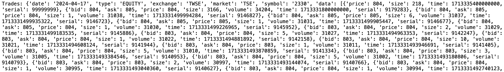
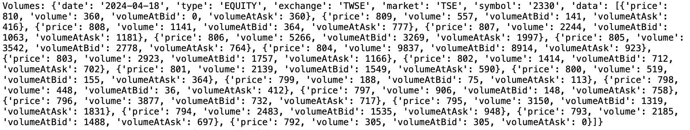

# 富邦Neo API 操作記錄--日內行情


## 富邦Neo API

Neo API為富邦證券最近推出新的跨平台API，其提供三種程式語言:{==Python、Nodejs、C#==}，詳細的介紹可以參考<a href="https://www.fbs.com.tw/TradeAPI/" target="_blank">富邦網站</a>，這裡將記錄在操作api的相關過程。


## 富邦Neo API 日內行情

!!! example "<a href="https://www.fbs.com.tw/TradeAPI/docs/market-data/http-api/getting-started" target="_blank">Web API</a>"

    ```
    # 首先需登入 API
    from fubon_neo.sdk import FubonSDK
    
    sdk = FubonSDK()
    res = sdk.login("{==登入ID==}", "{==登入密碼==}",  "{==憑證路徑==}",  "{==憑證密碼==}")
    
    # 登入成功後，取得 account資料。
    if res.is_success:
        account = res.data

    ===============
    # 日內行情 初始設定

    sdk.init_realtime()     # 建立行情連線
    rest_stock = sdk.marketdata.rest_client.stock          {==# 這個會一直用到==}
    
    ```

## Tickers

!!! example "股票代碼與名稱"

    - type:
        - EQUITY: 股票(含ETF).
        - INDEX: 指數.
        - WARRANT: 權證.
        - ODDLOT: 盤中零股.
    - exchange:
        - TWSE: 臺灣證券交易所
        - TPEx: 證券櫃檯買賣中心
    - market:
        - TSE: 上市
        - OTC: 上櫃
        - ESB: 興櫃一般板
        - TIB: 臺灣創新板
        - PSB: 興櫃戰略新板
    - industry:
        - 請參考<a href="https://www.fbs.com.tw/TradeAPI/docs/market-data/http-api/intraday/tickers/#%E7%94%A2%E6%A5%AD%E5%88%A5%E4%BB%A3%E7%A2%BC" target="_blank">連結</a>

    ```
    
    {++# Tickers++}
    res = rest_stock.intraday.tickers(type='EQUITY')
    print(res)
    
    ```
    
    

## Ticker

!!! example "商品(個股)資料"

    symbol: 股票代碼

    ```
    {++# Ticker++}
    res = rest_stock.intraday.ticker(symbol='2330')
    print(res)

    Ticker: {'date': '2024-04-17', 'type': 'EQUITY', 'exchange': 'TWSE', 'market': 'TSE', 'symbol': '2330', 'name': '台積電', 'industry': '24', 'securityType': '01', 'previousClose': 788, 'referencePrice': 788, 'limitUpPrice': 866, 'limitDownPrice': 710, 'canDayTrade': True, 'canBuyDayTrade': True, 'canBelowFlatMarginShortSell': True, 'canBelowFlatSBLShortSell': True, 'isAttention': False, 'isDisposition': False, 'isUnusuallyRecommended': False, 'isSpecificAbnormally': False, 'matchingInterval': 0, 'securityStatus': 'NORMAL', 'boardLot': 1000, 'tradingCurrency': 'TWD'}
    
    ```
    
    

## Quote

!!! example "報價資料"

    symbol: 股票代碼

    ```
    {++# Quote++}
    res = rest_stock.intraday.quote(symbol='2330')
    print(res)

    Quote: {'date': '2024-04-17', 'type': 'EQUITY', 'exchange': 'TWSE', 'market': 'TSE', 'symbol': '2330', 'name': '台積電', 'referencePrice': 788, 'previousClose': 788, 'openPrice': 798, 'openTime': 1713315602108144, 'highPrice': 808, 'highTime': 1713322408308545, 'lowPrice': 793, 'lowTime': 1713318452685501, 'closePrice': 804, 'closeTime': 1713331800000000, 'avgPrice': 800.84, 'change': 16, 'changePercent': 2.03, 'amplitude': 1.9, 'lastPrice': 804, 'lastSize': 3166, 'bids': [{'price': 804, 'size': 441}, {'price': 803, 'size': 212}, {'price': 802, 'size': 404}, {'price': 801, 'size': 455}, {'price': 800, 'size': 852}], 'asks': [{'price': 805, 'size': 253}, {'price': 806, 'size': 53}, {'price': 807, 'size': 119}, {'price': 808, 'size': 642}, {'price': 809, 'size': 292}], 'total': {'tradeValue': 27391846000, 'tradeVolume': 34204, 'tradeVolumeAtBid': 17344, 'tradeVolumeAtAsk': 14445, 'transaction': 9187, 'time': 1713331800000000}, 'lastTrade': {'bid': 804, 'ask': 805, 'price': 804, 'size': 3166, 'time': 1713331800000000, 'serial': 9179283}, 'lastTrial': {'bid': 804, 'ask': 805, 'price': 804, 'size': 3165, 'time': 1713331798797548, 'serial': 9178988}, 'isClose': True, 'serial': 9179283, 'lastUpdated': 1713331800000000}
    
    ```
    
    

## Candles

!!! example "K線資料"

    - symbol: 股票代碼
    - type: oddlot(盤中零股)
    - timeframe: 1, 5, 10, 15, 30, 60. {==相對k線的 分 週期==}

    未指定 timeframe 則為當日 1分K資料.

    ```
    {++# Candle++}
    res = rest_stock.intraday.candles(symbol='2330')
    print(res)

    Candles: {'date': '2024-04-17', 'type': 'EQUITY', 'exchange': 'TWSE', 'market': 'TSE', 'symbol': '2330', 'data': [{'date': '2024-04-17T09:00:00.000+08:00', 'open': 798, 'high': 798, 'low': 795, 'close': 797, 'volume': 3138, 'average': 797.6}, {'date': '2024-04-17T09:01:00.000+08:00', 'open': 798, 'high': 798, 'low': 797, 'close': 798, 'volume': 690, 'average': 797.6}, {'date': '2024-04-17T09:02:00.000+08:00', 'open': 798, 'high': 799, 'low': 797, 'close': 799, 'volume': 891, 'average': 797.63}, {'date': '2024-04-17T09:03:00.000+08:00', 'open': 798, 'high': 799, 'low': 798, 'close': 799, 'volume': 370, 'average': 797.7}, {'date': '2024-04-17T09:04:00.000+08:00', 'open': 799, 'high': 801, 'low': 798, 'close': 801, 'volume': 781, 'average': 797.99}, {'date': '2024-04-17T09:05:00.000+08:00', 'open': 801, 'high': 802, 'low': 800, 'close': 801, 'volume': 505, 'average': 798.24}, {'date': '2024-04-17T09:06:00.000+08:00', 'open': 801, 'high': 801, 'low': 799, 'close': 800, 'volume': 333, 'average': 798.34}, {'date': '2024-04-17T09:07:00.000+08:00', 'open': 800, 'high': 800, 'low': 798, 'close': 798, 'volume': 398, 'average': 798.37}, {'date': '2024-04-17T09:08:00.000+08:00', 'open': 798, 'high': 799, 'low': 797, 'close': 798, 'volume': 386, 'average': 798.36}, {'date': '2024-04-17T09:09:00.000+08:00', 'open': 798, 'high': 799, 'low': 797, 'close': 799, 'volume': 134, 'average': 798.35}, {'date': '2024-04-17T09:10:00.000+08:00', 'open': 799, 'high': 799, 'low': 797, 'close': 798, 'volume': 310, 'average': 798.34}, {'date': '2024-04-17T09:11:00.000+08:00', 'open': 797, 'high': 798, 'low': 797, 'close': 797, 'volume': 247, 'average': 798.3}, {'date': '2024-04-17T09:12:00.000+08:00', 'open': 797, 'high': 798, 'low': 797, 'close': 797, 'volume': 69, 'average': 798.29}, {'date': '2024-04-17T09:13:00.000+08:00', 'open': 797, 'high': 799, 'low': 797, 'close': 799, 'volume': 185, 'average': 798.29}, {'date': '2024-04-17T09:14:00.000+08:00', 'open': 798, 'high': 800, 'low': 798, 'close': 800, 'volume': 167, 'average': 798.31}, {'date': '2024-04-17T09:15:00.000+08:00', 'open': 800, 'high': 800, 'low': 799, 'close': 800, 'volume': 305, 'average': 798.36},...]} 
    
    ```
    
    

## Trades

!!! example "成交明細"

    - symbol: 股票代碼
    - type: oddlot(盤中零股)
    - offset: 偏移量
    - limit: 限制量

    回傳最後 N筆,測試時也不是回傳當日所有資料.
    ```
    {++# Trades++}
    res = rest_stock.intraday.trades(symbol='2330')
    print(res)

    Trades: {'date': '2024-04-17', 'type': 'EQUITY', 'exchange': 'TWSE', 'market': 'TSE', 'symbol': '2330', 'data': [{'price': 804, 'size': 218, 'time': 1713335400000000, 'serial': 99999999}, {'bid': 804, 'ask': 805, 'price': 804, 'size': 3166, 'volume': 34204, 'time': 1713331800000000, 'serial': 9179283}, {'bid': 804, 'ask': 805, 'price': 804, 'size': 1, 'volume': 31038, 'time': 1713331499994284, 'serial': 9146827}, {'bid': 804, 'ask': 805, 'price': 805, 'size': 6, 'volume': 31037, 'time': 1713331499935322, 'serial': 9146723}, {'bid': 804, 'ask': 805, 'price': 805, 'size': 1, 'volume': 31031, 'time': 1713331499905447, 'serial': 9146677}, {'bid': 804, 'ask': 805, 'price': 804, 'size': 1, 'volume': 31030, 'time': 1713331499226965, 'serial': 9145952}, {'bid': 803, 'ask': 804, 'price': 804, 'size': 2, 'volume': 31029, 'time': 1713331499183535, 'serial': 9145886}, {'bid': 803, 'ask': 804, 'price': 804, 'size': 5, 'volume': 31027, 'time': 1713331494963353, 'serial': 9142247}, {'bid': 803, 'ask': 804, 'price': 804, 'size': 1, 'volume': 31022, 'time': 1713331494881892, 'serial': 9142158}, {'bid': 803, 'ask': 804, 'price': 804, 'size': 10, 'volume': 31021, 'time': 1713331494608124, 'serial': 9141944}, {'bid': 803, 'ask': 804, 'price': 803, 'size': 1, 'volume': 31011, 'time': 1713331493946691, 'serial': 9141405}, {'bid': 803, 'ask': 804, 'price': 804, 'size': 5, 'volume': 31010, 'time': 1713331493870859, 'serial': 9141334}, {'bid': 803, 'ask': 804, 'price': 803, 'size': 3, 'volume': 31005, 'time': 1713331493384546, 'serial': 9140953}, {'bid': 803, 'ask': 804, 'price': 804, 'size': 5, 'volume': 31002, 'time': 1713331493180806, 'serial': 9140793}, {'bid': 803, 'ask': 804, 'price': 803, 'size': 2, 'volume': 30997, 'time': 1713331493144074, 'serial': 9140766}, {'bid': 803, 'ask': 804, 'price': 804, 'size': 1, 'volume': 30995, 'time': 1713331493040360, 'serial': 9140627}, {'bid': 803, 'ask': 804, 'price': 804, 'size': 1, 'volume': 30994, 'time': 1713331492740123, 'serial': 9140386}, {'bid': 803, 'ask': 804, 'price': 803, 'size': 6, 'volume': 30993, 'time': 1713331492651710, 'serial': 9140320}, {'bid': 803, 'ask': 804, 'price': 803, 'size': 1, 'volume': 30987, 'time': 1713331492566815, 'serial': 9140243}, {'bid': 803, 'ask': 804, 'price': 804, 'size': 5, 'volume': 30986, 'time': 1713331492371117, 'serial': 9140099}, {'bid': 803, 'ask': 804, 'price': 804, 'size': 2, 'volume': 30981, 'time': 1713331491580217, 'serial': 9139475}, {'bid': 803, 'ask': 804, 'price': 804, 'size': 1, 'volume': 30979, 'time': 1713331490679715, 'serial': 9138672},...]} 
    
    ```
    
    

## Volumes

!!! example "分價量表"

    - symbol: 股票代碼
    - type: oddlot(盤中零股)

    回傳當日的分價量表
    ```
    {++# Volumes++}
    res = rest_stock.intraday.volumes(symbol='2330')
    print(res)

    Volumes: {'date': '2024-04-18', 'type': 'EQUITY', 'exchange': 'TWSE', 'market': 'TSE', 'symbol': '2330', 'data': [{'price': 810, 'volume': 360, 'volumeAtBid': 0, 'volumeAtAsk': 360}, {'price': 809, 'volume': 557, 'volumeAtBid': 141, 'volumeAtAsk': 416}, {'price': 808, 'volume': 1141, 'volumeAtBid': 364, 'volumeAtAsk': 777}, {'price': 807, 'volume': 2244, 'volumeAtBid': 1063, 'volumeAtAsk': 1181}, {'price': 806, 'volume': 5266, 'volumeAtBid': 3269, 'volumeAtAsk': 1997}, {'price': 805, 'volume': 3542, 'volumeAtBid': 2778, 'volumeAtAsk': 764}, {'price': 804, 'volume': 9837, 'volumeAtBid': 8914, 'volumeAtAsk': 923}, {'price': 803, 'volume': 2923, 'volumeAtBid': 1757, 'volumeAtAsk': 1166}, {'price': 802, 'volume': 1414, 'volumeAtBid': 712, 'volumeAtAsk': 702}, {'price': 801, 'volume': 2139, 'volumeAtBid': 1549, 'volumeAtAsk': 590}, {'price': 800, 'volume': 519, 'volumeAtBid': 155, 'volumeAtAsk': 364}, {'price': 799, 'volume': 188, 'volumeAtBid': 75, 'volumeAtAsk': 113}, {'price': 798, 'volume': 448, 'volumeAtBid': 36, 'volumeAtAsk': 412}, {'price': 797, 'volume': 906, 'volumeAtBid': 148, 'volumeAtAsk': 758}, {'price': 796, 'volume': 3877, 'volumeAtBid': 732, 'volumeAtAsk': 717}, {'price': 795, 'volume': 3150, 'volumeAtBid': 1319, 'volumeAtAsk': 1831}, {'price': 794, 'volume': 2483, 'volumeAtBid': 1535, 'volumeAtAsk': 948}, {'price': 793, 'volume': 2185, 'volumeAtBid': 1488, 'volumeAtAsk': 697}, {'price': 792, 'volume': 305, 'volumeAtBid': 305, 'volumeAtAsk': 0}]} 
    
    ```
    
    