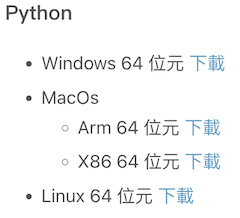
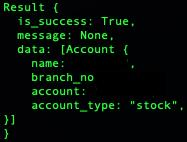

# 富邦Neo API 操作記錄--安裝、登入、登出


## 富邦Neo API

Neo API為富邦證券最近推出新的跨平台API，其提供三種程式語言:{==Python、Nodejs、C#==}，詳細的介紹可以參考<a href="https://www.fbs.com.tw/TradeAPI/" target="_blank">富邦網站</a>，這裡將記錄在操作api的相關過程。

## 富邦Neo API 安裝SDK

!!! example "安裝Python SDK套件"

    先從富邦API網站下載<a href="https://www.fbs.com.tw/TradeAPI/docs/download/download-sdk/" target="_blank"> SDK</a>，選擇適合作業系統的版本。

    

    ```
    # 我下戴的版本的 1.0.1 for mac X86.請更換為下載的檔名
    pip install fubon_neo-1.0.1-cp37-abi3-macosx_10_7_x86_64.whl
    ```
    

## 富邦Neo API Login、Logout

!!! example "登入"

    ```
    from fubon_neo.sdk import FubonSDK

    sdk = FubonSDK()
    res = sdk.login("{==登入ID==}", "{==登入密碼==}",  "{==憑證路徑==}",  "{==憑證密碼==}")
    print(res)

    # 登入成功後，取得 account資料。
    if res.is_success:
        account = res.data

    ```
    如果有收到以下的回應，那就是登入成功或是利用回傳的資料 is_success來判斷；從account_type可以判斷這個帳號是股票還是期貨。

    


!!! example "登出"

    ```
    # 登入API之後

    res = sdk.logout()
    print(res)
    ```

    看到True 表示已登出API。

    
