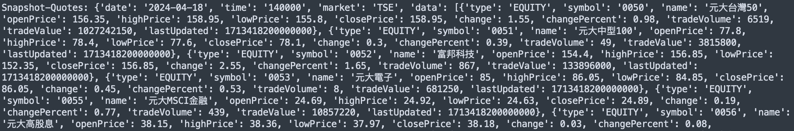
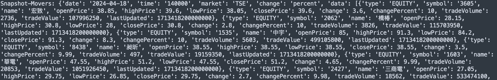
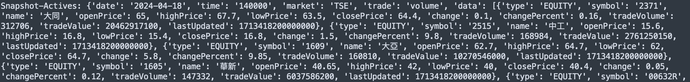

# 富邦Neo API 操作記錄--行情快照


## 富邦Neo API

Neo API為富邦證券最近推出新的跨平台API，其提供三種程式語言:{==Python、Nodejs、C#==}，詳細的介紹可以參考<a href="https://www.fbs.com.tw/TradeAPI/" target="_blank">富邦網站</a>，這裡將記錄在操作api的相關過程。


## 富邦Neo API 行情快照

!!! example "<a href="https://www.fbs.com.tw/TradeAPI/docs/market-data/http-api/snapshot/quotes" target="_blank">Snapshot</a>"

    ```
    # 首先需登入 API
    from fubon_neo.sdk import FubonSDK
    
    sdk = FubonSDK()
    res = sdk.login("{==登入ID==}", "{==登入密碼==}",  "{==憑證路徑==}",  "{==憑證密碼==}")
    
    # 登入成功後，取得 account資料。
    if res.is_success:
        account = res.data

    ===============
    # 日內行情 初始設定

    sdk.init_realtime()     # 建立行情連線
    rest_stock = sdk.marketdata.rest_client.stock          {==# 這個會一直用到==}
    
    ```

## Snapshot Quotes

!!! example "股票行情快照"

    market:

    - TSE: 上市
    - OTC: 上櫃
    - ESB: 興櫃一般板
    - TIB: 台灣創新板
    - PSB: 興櫃戰略新板

    ```
    
    {++# Tickers++}
    res = rest_stock.snapshot.quotes(market='TSE')
    print(res)

    Snapshot-Quotes: {'date': '2024-04-18', 'time': '140000', 'market': 'TSE', 'data': [{'type': 'EQUITY', 'symbol': '0050', 'name': '元大台灣50', 'openPrice': 156.35, 'highPrice': 158.95, 'lowPrice': 155.8, 'closePrice': 158.95, 'change': 1.55, 'changePercent': 0.98, 'tradeVolume': 6519, 'tradeValue': 1027242150, 'lastUpdated': 1713418200000000}, {'type': 'EQUITY', 'symbol': '0051', 'name': '元大中型100', 'openPrice': 77.8, 'highPrice': 78.4, 'lowPrice': 77.6, 'closePrice': 78.1, 'change': 0.3, 'changePercent': 0.39, 'tradeVolume': 49, 'tradeValue': 3815800, 'lastUpdated': 1713418200000000}, {'type': 'EQUITY', 'symbol': '0052', 'name': '富邦科技', 'openPrice': 154.4, 'highPrice': 156.85, 'lowPrice': 152.35, 'closePrice': 156.85, 'change': 2.55, 'changePercent': 1.65, 'tradeVolume': 867, 'tradeValue': 133896000, 'lastUpdated': 1713418200000000}, {'type': 'EQUITY', 'symbol': '0053', 'name': '元大電子', 'openPrice': 85, 'highPrice': 86.05, 'lowPrice': 84.85, 'closePrice': 86.05, 'change': 0.45, 'changePercent': 0.53, 'tradeVolume': 8, 'tradeValue': 681250, 'lastUpdated': 1713418200000000}, {'type': 'EQUITY', 'symbol': '0055', 'name': '元大MSCI金融', 'openPrice': 24.69, 'highPrice': 24.92, 'lowPrice': 24.63, 'closePrice': 24.89, 'change': 0.19, 'changePercent': 0.77, 'tradeVolume': 439, 'tradeValue': 10857220, 'lastUpdated': 1713418200000000}, {'type': 'EQUITY', 'symbol': '0056', 'name': '元大高股息', 'openPrice': 38.15, 'highPrice': 38.36, 'lowPrice': 37.97, 'closePrice': 38.18, 'change': 0.03, 'changePercent': 0.08, 'tradeVolume': 57649, 'tradeValue': 2200785540, 'lastUpdated': 1713418200000000}, ...}
    
    ```
    
    

## Snapshot Movers

!!! example "漲跌排行"

    - market: TSE,OTC,ESB,TIB,PSB
    - direction: up, down
    - change: percent, value

    ```
    {++# Movers++}
    res = rest_stock.snapshot.movers(market='TSE', direction='up', change='percent')
    print(res)

    Snapshot-Movers: {'date': '2024-04-18', 'time': '140000', 'market': 'TSE', 'change': 'percent', 'data': [{'type': 'EQUITY', 'symbol': '3605', 'name': '宏致', 'openPrice': 38.85, 'highPrice': 39.6, 'lowPrice': 38.05, 'closePrice': 39.6, 'change': 3.6, 'changePercent': 10, 'tradeVolume': 2736, 'tradeValue': 107996250, 'lastUpdated': 1713418200000000}, {'type': 'EQUITY', 'symbol': '2062', 'name': '橋椿', 'openPrice': 28.15, 'highPrice': 30.8, 'lowPrice': 28, 'closePrice': 30.8, 'change': 2.8, 'changePercent': 10, 'tradeVolume': 3826, 'tradeValue': 115703950, 'lastUpdated': 1713418200000000}, {'type': 'EQUITY', 'symbol': '1535', 'name': '中宇', 'openPrice': 85, 'highPrice': 91.3, 'lowPrice': 84.2, 'closePrice': 91.3, 'change': 8.3, 'changePercent': 10, 'tradeVolume': 5603, 'tradeValue': 499105800, 'lastUpdated': 1713418200000000}, {'type': 'EQUITY', 'symbol': '8438', 'name': '昶昕', 'openPrice': 38.55, 'highPrice': 38.55, 'lowPrice': 38.55, 'closePrice': 38.55, 'change': 3.5, 'changePercent': 9.99, 'tradeVolume': 497, 'tradeValue': 19159350, 'lastUpdated': 1713418200000000}, {'type': 'EQUITY', 'symbol': '1603', 'name': '華電', 'openPrice': 47.55, 'highPrice': 51.2, 'lowPrice': 47.55, 'closePrice': 51.2, 'change': 4.65, 'changePercent': 9.99, 'tradeVolume': 20853, 'tradeValue': 1051926450, 'lastUpdated': 1713418200000000}, {'type': 'EQUITY', 'symbol': '2427', 'name': '三商電', 'openPrice': 27.05, 'highPrice': 29.75, 'lowPrice': 26.85, 'closePrice': 29.75, 'change': 2.7, 'changePercent': 9.98, 'tradeVolume': 18562, 'tradeValue': 533474100, 'lastUpdated': 1713418200000000}, {'type': 'EQUITY', 'symbol': '6230', 'name': '尼得科超眾', 'openPrice': 226, 'highPrice': 226, 'lowPrice': 226, 'closePrice': 226, 'change': 20.5, 'changePercent': 9.98, 'tradeVolume': 451, 'tradeValue': 101926000, 'lastUpdated': 1713418200000000},...]}
    
    ```
    
    

## Snapshot Actives

!!! example "成交量(值)排行"

    - market: TSE,OTC,ESB,TIB,PSB
    - trade: volume(量), value(值)

    ```
    {++# Actives++}
    res = rest_stock.snapshot.actives(market='TSE', trade='volume')
    print(res)

    Snapshot-Actives: {'date': '2024-04-18', 'time': '140000', 'market': 'TSE', 'trade': 'volume', 'data': [{'type': 'EQUITY', 'symbol': '2371', 'name': '大同', 'openPrice': 65, 'highPrice': 67.7, 'lowPrice': 63.5, 'closePrice': 64.4, 'change': 0.1, 'changePercent': 0.16, 'tradeVolume': 312706, 'tradeValue': 20462917100, 'lastUpdated': 1713418200000000}, {'type': 'EQUITY', 'symbol': '2515', 'name': '中工', 'openPrice': 15.6, 'highPrice': 16.8, 'lowPrice': 15.4, 'closePrice': 16.8, 'change': 1.5, 'changePercent': 9.8, 'tradeVolume': 168984, 'tradeValue': 2761250150, 'lastUpdated': 1713418200000000}, {'type': 'EQUITY', 'symbol': '1609', 'name': '大亞', 'openPrice': 62.7, 'highPrice': 64.7, 'lowPrice': 62, 'closePrice': 64.7, 'change': 5.8, 'changePercent': 9.85, 'tradeVolume': 160810, 'tradeValue': 10270546000, 'lastUpdated': 1713418200000000}, {'type': 'EQUITY', 'symbol': '1605', 'name': '華新', 'openPrice': 40.65, 'highPrice': 42, 'lowPrice': 40, 'closePrice': 40.4, 'change': 0.05, 'changePercent': 0.12, 'tradeVolume': 147332, 'tradeValue': 6037586200, 'lastUpdated': 1713418200000000}, {'type': 'EQUITY', 'symbol': '00632R', 'name': '元大台灣50反1', 'openPrice': 3.97, 'highPrice': 3.97, 'lowPrice': 3.91, 'closePrice': 3.92, 'change': -0.02, 'changePercent': -0.51, 'tradeVolume': 144565, 'tradeValue': 568939930, 'lastUpdated': 1713418200000000},..]}
    
    ```
    
    
