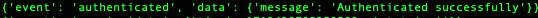
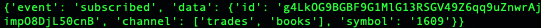
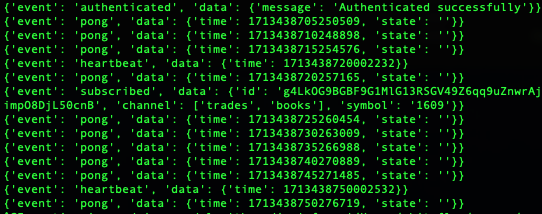

# 富邦Neo API 操作記錄--即時行情


## 富邦Neo API

Neo API為富邦證券最近推出新的跨平台API，其提供三種程式語言:{==Python、Nodejs、C#==}，詳細的介紹可以參考<a href="https://www.fbs.com.tw/TradeAPI/" target="_blank">富邦網站</a>，這裡將記錄在操作api的相關過程。


## 富邦Neo API 即時行情

!!! example "<a href="https://www.fbs.com.tw/TradeAPI/docs/market-data/websocket-api/getting-started" target="_blank">WebSocket</a>"

    ```
    # 首先需登入 API
    from fubon_neo.sdk import FubonSDK
    {++import json++}   # 會用到

    sdk = FubonSDK()
    res = sdk.login("{==登入ID==}", "{==登入密碼==}",  "{==憑證路徑==}",  "{==憑證密碼==}")
    
    # 登入成功後，取得 account資料。
    if res.is_success:
        account = res.data

    ===============
    # 即時行情

    sdk.init_realtime()     # 建立行情連線

    rt_data = sdk.marketdata.websocket_client.stock      {==# 這個會一直用到==}
    rt_data.on('message', recvRTData)                    {==# 將real time資料給處理的 function==}

    rt_data.connect()                                    {==# 建立websocket連線==}
    ```
    如果有收到以下的回應，那就是websocket.connect 成功了。

    


!!! example "訂閱行情"

    行情訂閱資料有三種:

    - trades: 成交明細.
    - books: 五檔報價.
    - indices: 指數資訊.

    ```
    # 完成以上動作後，才可以開始進行訂閱
    {++#訂閱++}
    {==# 單一個股與資料==}
    rt_data.subscribe({
        'channel': 'trades',
        'symbol': '2330'
    })

    {==# 多個股單一資料==}
    rt_data.subscribe({
        'channel': 'books',
        'symbol': ['2330', '2317', '3231']
    })

    {==# 單個股多資料==}
    rt_data.subscribe({
        'channel': ['trades', 'books'],
        'symbol': '2330'
    })

    
    ```
    訂閱成功會有訊息.

    

!!! example "處理行情"

    ```
    def recvRTData(message):
        #{==需要注意這裡的資料型態==}
        #{==websocket傳過來的資料是 string,所以需要用json轉成python dict==}
        data = json.loads(message)

        if data['event'] == 'subscribed':
            {==# 訂閱成功後，需要記錄下來 channel的id，因為取消訂閱是使用 channel id來取消.}

        if data['event'] == 'pong':
            {==# 當執行rt_data.connect()後，就會開始教到此event ==}
            {==# 寫入要處理此 event的程式 ==}

        if data['event'] == 'heartbeat':
            {==# 當執行rt_data.connect()後，就會開始教到此event ==}
            {==# 寫入要處理此 event的程式 ==}

        if data['event'] == 'heartbeat':

        if data['event'] == 'authenticated':
            # 連線成功
            

    ```

    

!!! example "取消訂閱行情"

    {==取消訂閱需要取得 channel id，所以要在 event: subscribed時記錄下來.==}

    ```
    
    {++# 取消訂閱++}
    {==# 單一Channel ==}
    rt_data.unsubscribe({
        'ids': v
    })

    {==# 多單一Channel==}
    rt_data.unsubscribe({
        'ids': ['id1', 'id2']
    })

    ```