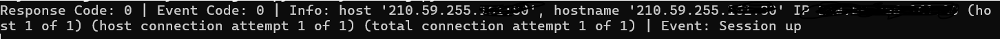

# 永豐金Shioaji api 測試報告教學


## Shioaji API測試報告

!!! warning "請先線上完成 API下單簽署後再進行API測試報告。"

## 測試方式

!!! info "登入測試"

    ```
    import shioaji as sj

    api = sj.Shioaji(simulation=True)
    api.login(api_key="your_api_key", secret_key="your_secreat_key")
    ```
    如果你有收到以下的回應，那就是登入成功同時也完成登入測試了，接著進行下單測試。

    


!!! info "下單測試"

    <span style="color:red;font-weight:bold;">務必登入在模擬模式</span>

    ```
    #成功登入模擬模式之後

    # 先取得個股資訊
    contract = api.Contracts.Stocks.TSE["2330"]

    # 建立 Order
    order = api.Order(
        price=700,                                      # 委託價格
        quantity=1,                                     # 委託數量
        action=sj.constant.Action.Buy,                  # 買進
        price_type=sj.constant.StockPriceType.LMT,      # 限價單
        order_type=sj.constant.OrderType.ROD,           # 當日有效單
        account=api.stock_account                       # 下單帳號
    )

    # 執行下單 : api.place_order()
    trade = api.place_order(contract, order)
    print(trade)
    ```

    正常狀況下會看到下單成功的資訊，此時就完成下單的測試了。


## 使用EyeTrading 協助完成測試(已有程式經驗的使用者)

!!! example "登入測試"

    由於EyeTrading 使用的Shioaji 版本為 > 1.0，所以您需要使用token來進行登入，請參照使用說明中將token資訊填入設定檔後存檔，於程式選單中選登入 <span style="color:red">永豐Api-模擬模式 </span>，程式會開始連線到Shioaji server並進行token驗證，您可在訊息記錄查看登入時的訊息以及帳號相關資訊。

    { width=200}

    token 資訊設定正確的話，應該會看到登入成功的訊息，此時已完成登入測試。

    


!!! example "證券下單測試"

    登入成功之後同時確認回傳過來的帳戶資訊內容是否有 <span style="color:red;">signed=True</span>如下圖所示，若有則代表此帳號已完成測試；若無請開啟 <span style="color:red;">閃電下單機器人</span>

    ```
    [FutureAccount(person_id='QBCCAIGJBJ', broker_id='F002000', account_id='9100020', signed=True, username='PAPIUSER01'),
    StockAccount(person_id='QBCCAIGJBJ', broker_id='9A95', account_id='0504350', username='PAPIUSER01')]
    ```

    請先輸入個股代號之後，價位會更新至當日的價格，然後點選買進欄位即完成下單。<br>
    此時可回到主畫面查看剛剛下單資訊，可看到狀態是委託成功，此時即已完成<span style="color:red;">證券帳號</span>的下單測試(點選委託成功欄位可進行刪單)。<br>
    PS:有期貨帳號也需要測試下單，請自行寫程式測試看看。

    {width=250}

    {}

    {}


