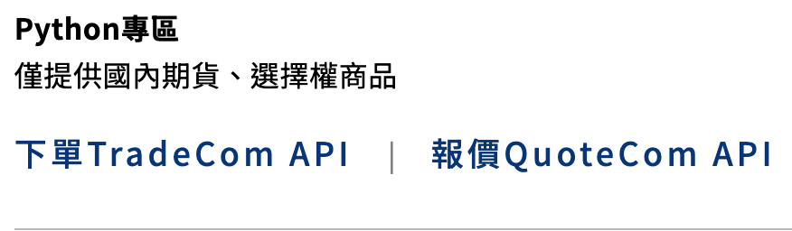

# 凱基API 操作記錄--下載與安裝


## 凱基API

凱基API 為凱基證券/期貨所出的API，其提供三種程式語言:{==C#、VBA、Python==}，詳細的介紹可以參考<a href="https://www.kgif.com.tw/zh-tw/individual-trading-platform-api" target="_blank">凱基網站</a>，這裡會記錄在串接凱基期貨 api的相關過程。凱基期貨與證券使用的API需分別下載，此處串接期貨的下單，但用法應該大同小異。

## 凱基API 下載元件

!!! example "下載元件"

    先從凱基期貨網站下載<a href="https://www.fbs.com.tw/TradeAPI/docs/download/download-sdk/" target="_blank"> API 元件 </a>。

    

## 凱基API 安裝Python套件

!!! example "Python 安裝相關套件"

    ```
    c:\kgi_api\>pip install pythonnet

    ===安裝相關資訊===
    Collecting pythonnet
    Downloading pythonnet-3.0.3-py3-none-any.whl (290 kB)
        ━━━━━━━━━━━━━━━━━━━━━━━━━━━━━━━━━━━━━━━ 291.0/291.0 kB 1.8 MB/s eta 0:00:00
    Collecting clr-loader<0.3.0,>=0.2.6
    Downloading clr_loader-0.2.6-py3-none-any.whl (51 kB)
    ...略...


    c:\kgi_api\>pip list
    ...略...
    {==clr-loader 0.2.6    <==要有==}
    {==pythonnet  3.0.3    <==要有==}
    ...略...

    ```
