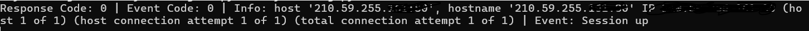

# 永豐Shioaji api 操作記錄--安裝、登入、登出


## Shioaji API Install

!!! example "安裝套件"
    ```
    pip install shioaji
    # 指定版本
    pip install shioaji==1.2.0
    # version up
    pip install --upgrade shioaji
    ```
    

## Shioaji API Login、Logout

!!! example "<a href="https://sinotrade.github.io/tutor/login/" target="_blank">登入</a>"

    ```
    import shioaji as sj

    # 正式環境
    api = sj.Shioaji()
    api.login(api_key="your_api_key", secret_key="your_secreat_key")

    # 測試環境
    api = sj.Shioaji({==simulation=True==})
    api.login(api_key="your_api_key", secret_key="your_secreat_key")
    ```
    如果有收到以下的回應，那就是登入成功，同時會需要等待約30秒來下載 Contracts 資料，沒有等 Contracts下載完，下單跟取得報價基本上是無法使用的。

    

    ```
    import shioaji as sj

    def recvContracts(contract_type):
        if contract_type == sj.constant.SecurityType.Index:
            print("指數")
        if contract_type == sj.constant.SecurityType.Stock:
            print("股票")
        if contract_type == sj.constant.SecurityType.Future:
            print("期貨")
        if contract_type == sj.constant.SecurityType.Option:
            print("選擇權")

    api = sj.Shioaji({==simulation=True==})
    api.login(api_key="your_api_key", secret_key="your_secreat_key", contracts_cb=recvContracts)
    ```
    利用 function來接收合約下載的情況。


!!! example "登出"

    ```
    # 登入之後，正式跟測試環境

    api.logout()
    ```

    正常情況不會看到什麼回應。
